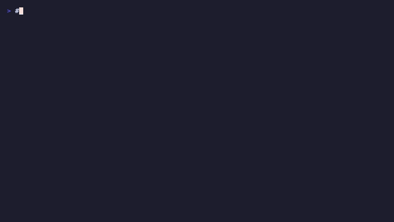

# Onlook Next




Svelte-first visual editing core inspired by Onlook, implemented as a Bun workspace plus a Phoenix backend.

## Intention

This repository is being repurposed from a direct Onlook fork into a new product direction:

- keep the visual, source-aware editing model
- replace the hosted app backend shape with Phoenix for sessions, presence, and persistence
- center the editing engine on a framework-neutral IR
- ship Svelte first, then extend the same engine to React and Vue
- treat Zig as a later optimization tool for measured hot paths, not as the primary app rewrite

The current code is the first vertical slice of that direction. It proves the architecture with a React editor shell, a Svelte-first TypeScript framework engine, and a Phoenix backend for projects, sessions, and collaboration channels.

## What is implemented

- React editor app with:
  - source pane
  - framework-neutral tree view
  - preview surface with selectable nodes
  - inspector actions for text, class, insert, move, and remove
  - backend persistence actions for project/session creation and source saves
- TypeScript framework engine with:
  - shared `EditorNode` / `EditorDocument` contracts
  - Svelte parser + source regeneration
  - React parser baseline + source regeneration
  - Vue adapter stub that fails explicitly for now
- Phoenix backend with:
  - persisted `projects` and `sessions`
  - JSON APIs
  - project collaboration channel
  - presence tracking

## Run it

1. Install JS dependencies:

```bash
bun install
```

2. Start Phoenix:

```bash
cd apps/backend
mix deps.get
mix ecto.create
mix ecto.migrate
mix phx.server
```

3. In another terminal, start the editor:

```bash
bun run dev:editor
```

The editor runs at `http://localhost:5173` and talks to Phoenix at `http://localhost:4000`.

## Validation

```bash
bun run build
bun run test
bun run typecheck
cd apps/backend && mix test
```
