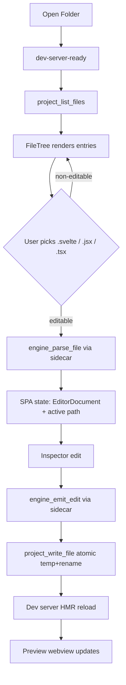

# Design — `add-desktop-file-tree`

## Context

`add-desktop-shell` shipped the plumbing: a Tauri window, a dev-server supervisor, a Bun sidecar that hosts `framework-engine`, a preview webview, and a runtime adapter on the SPA side that already knows how to `invoke` IPC commands. What's missing is the trigger: nothing in the SPA ever hands `engine_parse_file` a path, so the entire sidecar code path is compiled but unused. The minimum-viable loop is "click file → edit → save," and that requires three things — a way to discover files, a way to open one, and a way to write one back.



## Goals

1. Ship the smallest UI that lets the owner pick `src/routes/+page.svelte` in `~/Desktop/portfolio-forever` and see it in the inspector.
2. Persist inspector edits back to disk without clobbering the file or leaving a half-written temp.
3. Keep the browser-mode editor (`bun run dev:editor`) working unchanged — no new hard dependencies on Tauri.
4. Zero new crates, zero new npm packages.

## Non-goals

- **File watching.** `notify` is sitting in the `desktop-shell` dependency list but we do not wire it here. The dev server is the HMR feedback loop for v1.
- **File search, multi-file selection, rename, create, delete.** Read + single-file write only.
- **Git awareness.** No badges, no diff view, no staging. A future `add-desktop-git-aware` proposal is the right home for that.
- **Binary file preview.** Images, fonts, and wasm blobs show up as grayed-out non-editable entries; clicking them is a no-op.
- **Lazy subdirectory loading.** One recursive walk per project open is enough for v1 — the 10k entry cap covers any realistic source tree.

## Key decisions

### 1. One-shot recursive scan, hardcoded blocklist

Walking the filesystem is the hot path the first time a project opens. Three options considered:

- **`walkdir` crate + `ignore` crate**: Respects `.gitignore`, fast, battle-tested. But adds two crates and the `ignore` crate pulls in `globset` and `regex`. We explicitly said zero new crates for this change.
- **`tokio::fs::read_dir` recursively**: Async, but each recursion point allocates a future. Over 10k entries this adds up and gives us nothing — the scan is IO-bound, not CPU-bound, and we only do it once per open.
- **`std::fs::read_dir` inside `tokio::task::spawn_blocking`**: Synchronous walk on a blocking thread, hardcoded blocklist. Zero crates, ~80 lines, trivially testable.

**Choice: option 3.** Blocking walk on a worker thread, hardcoded blocklist matching the top of `proposal.md`. If a project has weird ignores that the blocklist misses we'll learn about it the moment a `node_modules` clone shows up in the tree and we'll revisit — but the target project has a standard SvelteKit shape so this is safe for v1.

### 2. Flat entry list, tree built in SPA

The Rust scan returns `Vec<FileEntry>` — a flat list sorted by path. The SPA builds the tree structure from the flat list in React. Two reasons:

- The sort order is deterministic (directories before files at each level, then alphabetic), which is easy to reason about.
- A flat list crosses the IPC boundary as one `serde_json::to_string` call; a nested tree would recursively serialize and be harder to truncate cleanly when we hit the 10k cap.

Each `FileEntry` carries:

```rust
struct FileEntry {
  path: String,       // absolute
  relative: String,   // relative to project root (what the UI shows)
  kind: "file" | "dir",
  size: Option<u64>,  // files only
  editable: bool,     // extension ∈ { svelte, jsx, tsx }
}
```

### 3. `project_write_file` is the only write path

`engine_emit_edit` returns the new `EditorDocument` including `document.source`. The SPA already updates its in-memory state from that. The new `project_write_file(path, contents)` command is a pure persistence call — no parsing, no IR, no sidecar involvement. Splitting write from emit keeps the sidecar stateless per call and means a future "dry run / preview diff" feature can emit without persisting.

Atomicity: write to `<target>.onlook.tmp` in the same directory, then `std::fs::rename` to the target path. APFS rename is atomic for same-volume paths, so this is as safe as we can be without `fsync` acrobatics.

Path containment check: canonicalize both `root` and `target`, reject if `target` does not start with `root`. Also reject any component in the target path that is a symlink — a symlinked `src/shared` pointing outside the project would otherwise allow a write escape. We use `std::fs::symlink_metadata` on each ancestor.

### 4. Framework inferred from extension, not from the project

The SPA already supports Svelte and React via `framework-engine`. The Vue parser is marked disabled upstream. So:

- `.svelte` → `svelte`
- `.jsx`, `.tsx` → `react`
- `.js`, `.ts` → `react` (JSX parser handles these too, and `applyEdit` is a no-op for files with no JSX trees)
- everything else → not editable, entry rendered grayed out, selection is a no-op

We do not try to guess from the project's framework flag. A SvelteKit project can have a `.tsx` component in `src/lib/` for some reason, and we want the right parser to run on that file.

### 5. Desktop-mode panel layout swap

The current SPA layout in browser mode is four panels: Source / Structure / Preview / Inspector. In desktop mode with this change, the left rail becomes FileTree / Structure stacked, the right rail stays Preview / Inspector. No change to browser mode — the framework-pill sample editor still shows up there. The seam is a single ternary in `App.tsx`'s `main.grid`.

The Source textarea stays but is repurposed in desktop mode: when a file is loaded, it shows the read-only source string from `document.source` so the user can confirm what's on disk after an edit. It is not an editing surface in desktop mode — edits go through the inspector only, same as today.

### 6. Edit → write → HMR contract

The dev server's own HMR is the preview feedback loop. We do **not** need to emit a `preview-reload` event from Rust — the dev server already sends HMR frames over its own websocket, and the Tauri child webview picks them up. Our write is the trigger, HMR does the rest.

Failure mode: if HMR reload fails (syntax error in a neighbor file, dev server overloaded), the preview stays on the old render and the user eventually notices. We do not try to paper over this; it's the project's own dev server, not ours.

## Alternatives considered

- **`useSyncExternalStore`-based file system provider.** Fancier, and would let us integrate with React's concurrent rendering. But zero value for a single synchronous selection and it would fight the existing `useState` + `useEffect` pattern in `App.tsx`. Passed.
- **Lazy directory expansion.** Each directory fetches children on open. Good for 100k-file monorepos. The target is a single Vite project with a few hundred source files. Passed.
- **Git-aware tree.** Show changed files first, mark untracked files, etc. Useful but unrelated to the "make the loop work" goal. Deferred to `add-desktop-git-aware`.
- **File watcher-driven incremental tree.** `notify` crate watches the root and we refresh on creation/deletion/rename. Good future state, bad v1 scope — watcher setup is its own failure surface. Deferred to `add-desktop-file-watcher`.

## Open questions, resolved

| Question | Resolution |
|---|---|
| How does the SPA know when to call `project_list_files`? | After `dev-server-ready` fires and the project handle is set. Calling it earlier would race the dev-server readiness path, which is the current gate for "desktop mode has a loaded project." |
| Should the scan be cached across opens? | No. The one-shot cost at open is cheap and caching introduces invalidation bugs. |
| How does the user clear a selection? | Clicking the active file again, or opening a different file, or closing the project. No explicit "deselect" button. |
| What happens on write failure? | `project_write_file` returns a `CoreError`. The SPA catches it, shows a banner, and does not update its `syncStatus` to "saved." The in-memory `EditorDocument` stays at the post-edit state, so the next write attempt will try again. |
| How big can a file be? | 1 MB hard cap on read (parse), same cap on write. Anything bigger is shown in the tree as grayed out with a size tooltip. |
| Does the sidecar need new message types? | No. The existing `parse_file` and `emit_edit` variants already cover the round trip. Only the Rust and SPA sides gain new commands (`project_list_files`, `project_write_file`) that do not touch the sidecar. |

## Risks and mitigations

| Risk | Impact | Mitigation |
|---|---|---|
| Path traversal via symlinks | Write outside project root | Canonicalize root and target before containment check; reject any ancestor component that is a symlink |
| Temp file leak on crash | `*.onlook.tmp` files litter the project | Best-effort cleanup on next open: scan removes `*.onlook.tmp` siblings older than the current session start |
| Large file accidentally parsed | SPA freezes on a 50 MB minified bundle | 1 MB cap on `parse_file`; entries over 1 MB are marked non-editable in the scan output |
| Sidecar crash mid-edit | Write path thinks it still has a valid IR | Existing `SidecarCrashed` event already disables edit actions in the SPA via `StatusBanner` |
| Concurrent writes from two SPA actions | Last-writer-wins silent clobber | v1 is single-user, single-window; a write mutex lives in `files.rs` so even if two edits race, the rename order is deterministic |
