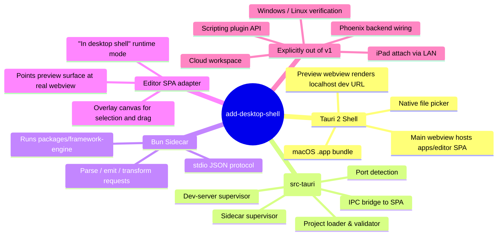

## Context

Onlook Next exists today as a Bun workspace: `apps/editor` is a Vite + React 19 SPA with a tree view, source pane, and preview surface; `packages/framework-engine` owns a framework-neutral `EditorDocument` IR plus Svelte and React parsers/regenerators; `apps/backend` is a Phoenix service intended for hosted collaboration. Nothing in the current codebase lets the owner open a local project folder, supervise its dev server, or write edits back to disk — the editor is wired for web hosting, not local-first use.

The immediate target is a single real fullstack project the owner wants to edit: `~/Desktop/portfolio-forever`, a SvelteKit + Vite + Convex application that runs via `bun run dev`. Success for this change is "the owner launches a desktop app, points it at that folder, and visually edits the Svelte tree against a live dev server." No shipping-to-users pressure, no auth, no cloud. The design must reflect that scope — anything built for hypothetical future users is waste.

## Goals / Non-Goals

**Goals:**
- Launch a macOS `.app` that opens a local project folder via a native picker and reaches a working visual editing state against that project's real dev server.
- Reuse 100% of `apps/editor` (React 19 SPA) and 100% of `packages/framework-engine` parse/emit logic. Zero rewrites of existing editor code or IR parsers.
- Keep the Rust core minimal: project loading, dev-server supervision, sidecar supervision, IPC bridging. No business logic belongs in Rust in v1.
- Preserve a clean seam so later proposals can add iPad attach (LAN workspace), plugin scripting, and cloud-hosted workspaces without a rewrite.
- Fail loudly on unsupported project shapes instead of silently degrading.

**Non-Goals:**
- iPadOS, Android, or any mobile shell. Deferred to a separate `add-ipad-attach` proposal.
- Scripting runtimes (JS plugins, Lua, Ruby). Deferred.
- Phoenix backend integration. `apps/backend` stays dormant in the repo; the desktop app does not call it.
- Multi-user presence, auth, billing, onboarding, empty states, analytics, telemetry, i18n, theming. This is a personal tool.
- Porting `framework-engine` to Rust. The Bun sidecar is the explicit compromise that keeps v1 small.
- Windows / Linux verification. Tauri should produce working builds for those targets but we do not test them in v1.
- Automatic dev-server failure recovery beyond surfacing the failure. If `bun run dev` crashes, show the error; do not try to restart repeatedly.
- Code signing, notarization, distribution. Local dev build only.

## Decisions

### Decision 1 — Tauri 2 over Electron, Swift/Catalyst, or pure Vite web

Picked Tauri 2 for the shell.

- **Alternatives considered**:
  - **Electron**: ships Chromium (~150MB binary), heavier memory, and the owner explicitly dislikes the "Electron look." Rejected.
  - **Swift + SwiftUI + WKWebView (Catalyst)**: best native macOS polish but locks us to Apple, throws away cross-platform headroom, and forces a second codebase when we later want Linux/Windows or Android tablets. Rejected for v1 but remains an option if we ever decide to go Apple-exclusive.
  - **Pure web (keep running in a browser tab)**: cannot supervise dev servers, cannot read local folders without user intervention. Rejected — it's the status quo we're trying to leave.
- **Why Tauri wins**: system WebView (~3MB binary vs ~150MB Electron), Rust core for OS integration, matching iOS/Android/Linux/Windows mobile targets available in Tauri 2 whenever we want them, and `apps/editor` as a Vite SPA is Tauri's happiest case (`index.html` → WebView directly, no extra build step).

### Decision 2 — Bun sidecar for framework-engine, not a Rust port

The Rust core invokes `framework-engine` by spawning a Bun subprocess and talking to it over stdio JSON-RPC.

- **Alternatives considered**:
  - **Port framework-engine to Rust**: 3–6 weeks of parser rewrite (Svelte AST, React AST, `EditorDocument` transforms). Delays v1 by months for no user-visible gain.
  - **Embed JavaScriptCore / QuickJS in Rust**: avoids subprocess overhead but pulls in a JS engine binding, complicates debugging, and Bun-specific APIs used by framework-engine may not run.
  - **Call framework-engine from the SPA directly (no Rust involvement)**: the SPA then has to know about file paths, file writes, and watch events — duplicates responsibilities and leaks the web security model into a desktop context.
- **Why sidecar wins**: framework-engine runs unmodified in its native runtime (Bun), Rust only has to manage process lifetime, and swapping to a Rust-native implementation later is a localized change inside the `src-tauri` crate because the SPA only sees IPC messages.
- **Non-obvious cost**: two Bun runtimes on disk (system Bun and the sidecar copy, if we bundle). Acceptable for v1.

### Decision 3 — Supervise the project's own dev server instead of owning the bundler

When the user opens a folder, the Rust core reads `package.json`, identifies the dev script, spawns it as a child process, parses stdout for the served URL, and waits until the port responds to a TCP probe.

- **Alternatives considered**:
  - **Own Vite/esbuild/SWC in-process**: breaks on any project with a non-Vite bundler, breaks on fullstack projects with custom dev servers (Next.js with API routes, SvelteKit with server hooks, Convex dev servers). Rejected.
  - **Build the project once and serve the static output**: loses HMR, defeats the point of live visual editing.
  - **Run framework-engine's own mini-bundler**: does not exist and is not worth writing.
- **Why subprocess supervision wins**: whatever the user's project does — Vite, Webpack, Turbopack, custom node scripts, `portless portfolio vite dev` — works without Onlook knowing. Compatibility scales with the ecosystem for free.
- **Port detection strategy**: match a regex against child stdout for common patterns (`localhost:\d+`, `Local:\s+http://...`, `ready on http://...`). If no match within a timeout, surface the raw output and ask the user to specify. No magic guessing.

### Decision 4 — Second WebView for preview, not an iframe inside the SPA

The user's project preview loads in a separate Tauri webview (child of the main window or a sibling), not an `<iframe>` inside the editor SPA.

- **Alternatives considered**:
  - **Iframe inside apps/editor**: simpler to wire, but cross-origin rules between the SPA (tauri://) and dev server (http://localhost) create surprising failures around `postMessage`, cookies, and event propagation. It also couples editor state to preview reloads.
  - **Separate Tauri window**: works but feels wrong for a single-project editor that wants a unified workspace.
- **Why child webview wins**: Tauri 2 supports child webviews attached to a parent window, giving us overlay-friendly geometry, independent navigation, and process isolation. The editor SPA draws selection handles on a transparent overlay layer aligned with the preview webview's bounding rect. Coordinate sync happens through Rust IPC, not direct DOM access.

### Decision 5 — No Phoenix, no Vapor, no server framework in v1

The Rust core does not expose a network server. All IPC is in-process via Tauri's command system and stdio to the sidecar.

- **Alternatives considered**:
  - **Start Phoenix in a background process and talk to it**: overkill for a single-user local tool.
  - **Embed Vapor**: same objection, and Vapor forces Swift-on-server when our client is React/TS.
  - **Embed Loco.rs / axum**: closer to idiomatic but still unnecessary — the network layer is zero users in v1.
- **Why nothing wins**: the absence of a network server is a feature. When we later add iPad attach (separate proposal), the Rust core grows a WebSocket listener as an additive feature flag; in v1 that listener is never instantiated.

### Decision 6 — macOS-first, ship what we can verify

v1 only has to work on macOS. Tauri will likely produce working Linux and Windows builds but we do not run them.

- **Why**: the owner develops on macOS, the target project lives on macOS, and testing three platforms triples QA for no v1 benefit. Separate platforms can be validated in later proposals when they become load-bearing.

## Risks / Trade-offs

- **Dev-server port detection fails on an unfamiliar framework** → start with a regex library for known frameworks (Vite, Next, SvelteKit, Astro, Remix, Nuxt), require an explicit `onlook.dev.port` override in `package.json` as the escape hatch, fail loudly if neither works.
- **Bun sidecar crashes mid-session and leaves a zombie** → Rust core owns the `Child` handle; on drop or panic the process is killed. Watchdog: if stdio is closed unexpectedly, surface a visible error and disable editing until user reopens project. Do not auto-restart in a loop.
- **HMR reload blows away selection state** → overlay layer subscribes to a `PreviewReloaded` IPC event and re-queries the current selection identifier against the new DOM; stale selections are dropped with a visible indicator rather than silently lost.
- **Editor SPA assumes browser hosting and breaks under Tauri** → introduce a thin runtime adapter module in `apps/editor` that detects `window.__TAURI_INTERNALS__` and switches preview surface, file IO, and project loading to IPC-backed implementations. Non-desktop usage still works (fallback = current mocked behavior).
- **Two Bun installations on disk (system + sidecar)** → accept the disk cost for v1; revisit when it becomes annoying. An alternative is requiring system Bun and spawning it directly — that's likely fine for a single-user tool and is the default plan.
- **Cross-origin between editor SPA (`tauri://localhost`) and preview (`http://localhost:5173`)** → by using a sibling child webview rather than an iframe, we sidestep same-origin restrictions entirely. Any inspection of the preview DOM happens via a Rust-injected probe script loaded into the preview webview, which posts events back to Rust and then to the SPA.
- **File watcher race with framework-engine edits** → when the Rust core writes an edit to disk, it marks a `debounce` window during which file-watcher events for that path are ignored, preventing an edit-then-read feedback loop with the sidecar.
- **macOS file system permissions (Gatekeeper, TCC)** → users granting access to arbitrary folders is a macOS prompt the first time. Accepted; no workaround needed for a personal tool.

## Migration Plan

There is nothing to migrate. The desktop shell is net-new under `apps/desktop/`. `apps/editor` gains a small runtime adapter but its existing web-mode behavior is preserved as the fallback.

**Rollback strategy**: delete `apps/desktop/` and revert the runtime adapter commit. No database, no infra, no user data.

## Open Questions

1. Does `apps/editor`'s current preview surface already render an `<iframe>`, or is it mocked against a test fixture? This determines whether the runtime adapter is a swap-out or a new code path. Resolved during the apply stage by reading `apps/editor/src`.
2. What exact API surface does `apps/editor` invoke on `framework-engine`? The sidecar IPC schema derives directly from this list; enumerate during the apply stage from `packages/framework-engine/src`.
3. Should `apps/desktop` live inside the Bun workspace (`"workspaces": ["apps/*"]`) or outside it because Cargo owns the Rust side? Leaning "inside" — the JS side of `apps/desktop` can share `@onlook-next/editor-contracts`, and the Cargo workspace lives under `apps/desktop/src-tauri`. Confirm during apply.
4. Which package manager does the dev-server supervisor assume? Target project uses Bun; SvelteKit templates default to npm/pnpm. Start with Bun detection only and extend when needed — do not over-generalize v1.
